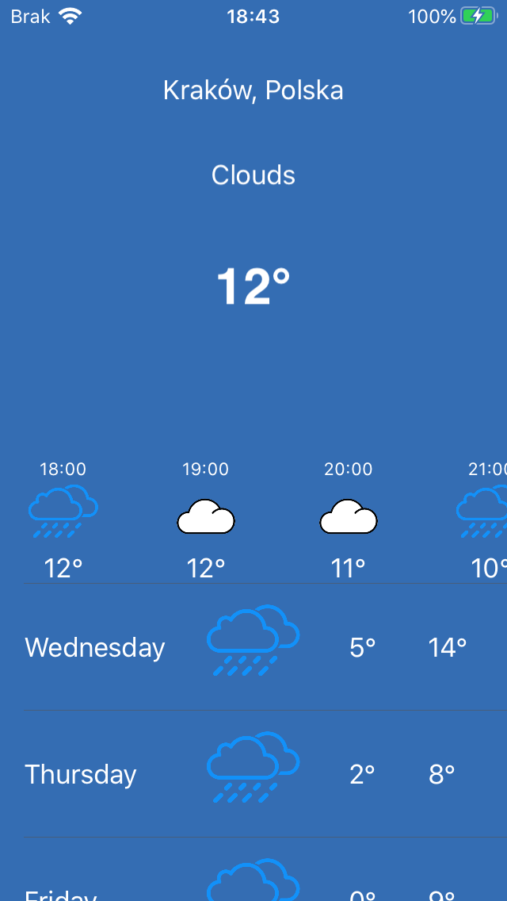

# WeatherApp
Weather App written in Swift using UIKit

Functionalities:
- displaying current location, forecast overview and current temperature in header view
- displaying hourly forecast (24h) in horizontal scroll view
- displaying daily forecast (7d) in table view

Forecast are acquired from Open Weather API.

